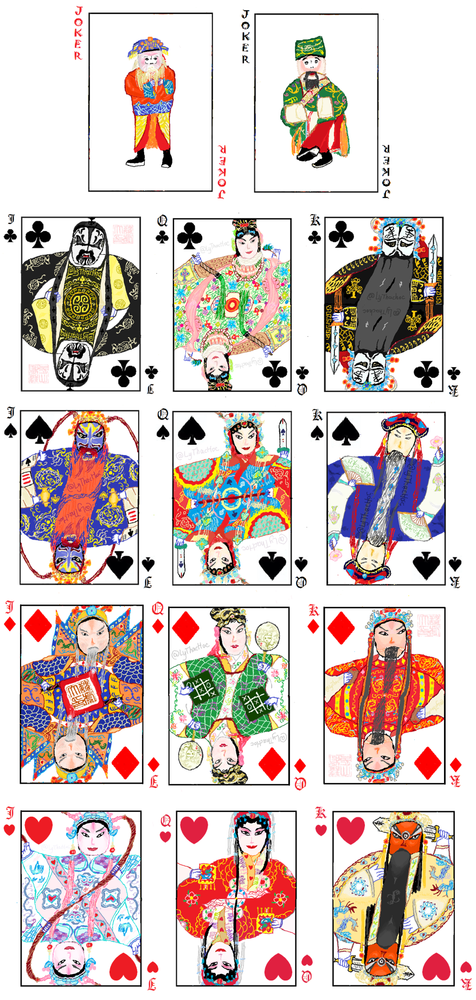

京剧主题扑克牌
======================

**人物：**

* JOKER

    - 大王：《锁五龙》程咬金

    - 小王：《群英会》蒋干

* 草花 

    - J：《黄一刀》姚刚

    - Q：《洛神》洛神

    - K：《霸王别姬》项羽

* 黑桃
    
    - J：《连环套》窦尔敦

    - Q：《双阳公主》双阳公主

    - K：《游龙戏凤》正德帝

* 方片

    - J：《定军山》黄忠

    - Q：《红娘》红娘

    - K：《大登殿》薛平贵

* 红桃

    - J：《群英会》周瑜

    - Q：《锁麟囊》薛湘灵

    - K：《斩黄袍》赵匡胤
